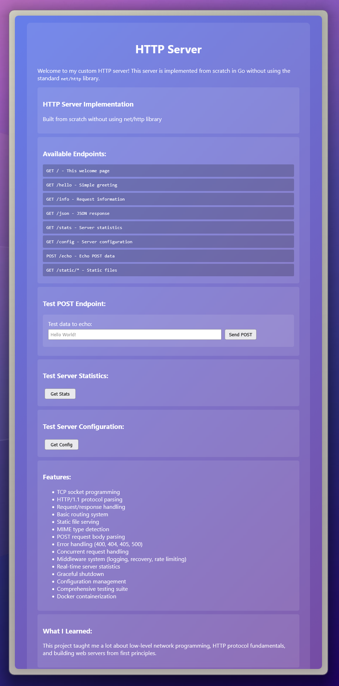

# HTTP Server from Scratch

This is a learning project where I implemented an HTTP server in Go without using the standard `net/http` library. The goal was to understand how web servers work at a low level by building everything from TCP socket connections up to a fully functional HTTP server.

<div align="center">
  
  <p><em>Web interface showing the server's capabilities and available endpoints</em></p>
</div>

## Why This Project?

I wanted to really understand how HTTP works under the hood. Instead of just using existing libraries, I decided to implement the entire HTTP protocol myself. This helped me learn about:

- TCP socket programming
- HTTP request/response parsing
- Concurrent connection handling
- Web server architecture

## Features

The server includes:
- HTTP/1.1 protocol support
- Static file serving with proper MIME types
- POST request handling with body parsing
- Basic routing system
- Concurrent request processing
- Request logging and statistics
- Configurable settings via JSON and environment variables
- Graceful shutdown handling
- Comprehensive error responses

## Getting Started

### Running the Server

```bash
# Basic usage
go run cmd/server/main.go

# With custom configuration
go run cmd/server/main.go -config=config.json

# Show version
go run cmd/server/main.go -version
```

### Configuration

The server can be configured via `config.json` or environment variables:

```bash
# Using environment variables
GOHTTP_PORT=9000 GOHTTP_HOST=0.0.0.0 go run cmd/server/main.go
```

### Testing

```bash
# Run tests
go test ./tests/...

# Basic endpoints
curl http://localhost:8080/
curl http://localhost:8080/hello
curl http://localhost:8080/stats

# POST example
curl -X POST http://localhost:8080/echo -d "test data"
```

## Docker Support

```bash
# Build and run
docker build -t gohttp .
docker run -p 8080:8080 gohttp

# Or use docker-compose
docker-compose up
```

## Project Structure

```
gohttp/
├── cmd/server/          # Main server application
├── internal/
│   ├── http/           # HTTP protocol implementation
│   ├── config/         # Configuration management
│   └── middleware/     # Middleware components
├── static/             # Static files for testing
├── tests/              # Test suite
└── config.json         # Default configuration
```

## Available Endpoints

- `GET /` - Main page with server info
- `GET /hello` - Simple greeting
- `GET /info` - Request information  
- `GET /stats` - Server statistics
- `GET /config` - Current configuration
- `POST /echo` - Echo request body
- `GET /static/*` - Static file serving

## What I Learned

Building this taught me a lot about:
- How HTTP actually works at the protocol level
- TCP connection management
- Parsing text-based protocols
- Go's concurrency model with goroutines
- Proper error handling in network applications
- Configuration management for server applications

## License

This is a learning project and is available for educational purposes.

